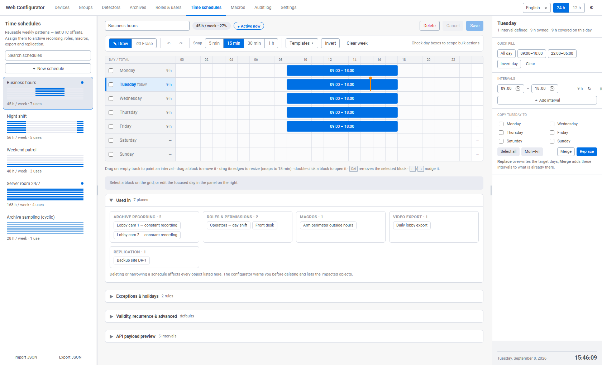
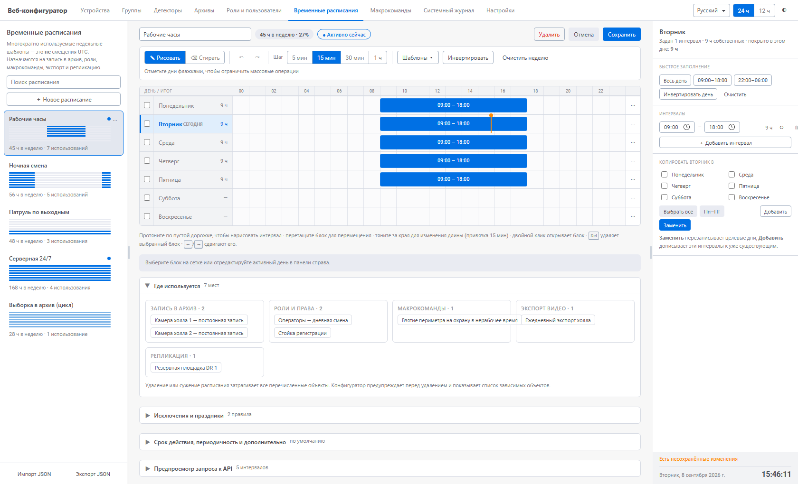

# Временные зоны / Time schedules — прототип для WEB-конфигуратора

Проработка экрана **«Временные зоны» / Time schedules** для веб-конфигуратора
ITV/Axxon (Интеллект X · Axxon One · Axxon Next). В репозитории лежит интерактивный
прототип интерфейса и документы, объясняющие принятые решения.

**Исходная задача.** Существовал первоначальный Figma-макет, повторяющий десктопный
конфигуратор, и два сгенерированных веб-прототипа. Ни один из трёх не покрывал
функциональность целиком: у одного была лучшая механика ввода, у другого — обзорность
и защита изменений, а доменные возможности десктопа (переход через полночь, праздники,
периодичность) терялись в обоих. Итоговый прототип `schedule_v3.html` объединяет сильные
стороны вариантов и возвращает утраченное.

---

## Быстрый старт

Откройте **`schedule_v3.html`** двойным кликом. Это один файл на ~112 КБ **без внешних
зависимостей** — ничего устанавливать и собирать не нужно, работает офлайн в любом
современном браузере.

В правом верхнем углу — переключатели языка (**Русский / English**), формата времени
(**24 ч / 12 ч**) и темы (светлая / тёмная). Данные в прототипе демонстрационные,
изменения живут только до перезагрузки страницы.

---

## Как это выглядит

Английская локаль, светлая тема, раскрыта панель «Где используется»:



Русская локаль; в правом нижнем углу видна строка состояния с индикатором
несохранённых изменений и часами сервера:



---

## Состав репозитория

| Файл | Что это |
|---|---|
| **`schedule_v3.html`** | **Итоговый прототип.** Самодостаточный HTML с встроенными CSS и JS |
| `TimeZones_Prototype_v3.MD` | Чем итоговый прототип отличается от двух предыдущих версий, и что нужно сверить перед реализацией |
| `Schedule_prototypes_analysis.md` | Подробный разбор всех трёх исходных вариантов: сильные и слабые стороны, матрица покрытия функций, обоснование выбора базы |
| `Time Schedule.html` | Исходный сгенерированный прототип №1 (упакованный артефакт на внутреннем DSL `<x-dc>` / `DCLogic`) |
| `screenshot-1.png` | Исходный сгенерированный прототип №2 — скриншот работающей страницы `#/time_zones` вместе с payload API в DevTools |
| `v3_en.png`, `v3_ru.png` | Актуальные превью итогового прототипа в двух локалях |
| `schedule_v3_preview.png` | Ранний скриншот прототипа, оставлен для истории — можно удалить |

Начинать чтение стоит с `TimeZones_Prototype_v3.MD`: он короче и отвечает на вопрос
«что изменилось и почему». `Schedule_prototypes_analysis.md` нужен, когда требуется
обоснование по конкретной функции.

---

## Что умеет прототип

**Сетка и редактирование**
- 7 строк × 24 часа; рисование интервала протяжкой по пустой дорожке, стирание протяжкой
  (в том числе поверх существующих блоков — они разрезаются).
- Перетаскивание блока, изменение длины за края, двойной клик открывает блок в панели дня.
- Шаг привязки 5 / 15 / 30 / 60 мин, undo/redo на 60 шагов.
- Точный ввод в таблице интервалов дня и в строке выбранного блока.

**Массовые операции**
- Чекбоксы дней задают **область действия**: шаблоны, инверсия и очистка бьют только по
  отмеченным дням, остальные строки приглушаются.
- 8 шаблонов с мини-диаграммой: рабочие часы, расширенный офис, две смены, ночи,
  нерабочее время, выходные, 24/7, цикличная выборка.
- Копирование дня с выбором режима **замены** или **добавления**, копирование одного
  интервала, инверсия дня или недели.

**Доменные возможности**
- **Интервалы через полночь**: одна ночная смена, а не два интервала; продолжение
  рисуется в следующем дне штриховкой и правится из исходного дня.
- **Цикличные интервалы**: «N мин каждые M мин» — для выборочной записи в архив.
- **Даты-исключения и праздники**: диапазон дат, режимы «нерабочий», «активно 24 часа»,
  «как в день недели», «свои интервалы», повтор ежегодно, комментарий, флаг
  общесерверного списка праздников.
- **Срок действия** расписания и **периодичность «каждые N дней»** для сменных
  графиков 2/2 и 4/4.

**Обзорность**
- Мини-превью недели, часы за неделю и счётчик использований в карточках списка.
- Итог по каждому дню с учётом переноса с предыдущего дня, % покрытия недели.
- Маркер текущего времени на сетке, бейдж «сегодня», признак «активно сейчас».
- Панель **«Где используется»** с разбивкой: запись в архив · роли · макрокоманды ·
  экспорт видео · репликация.

**Защита изменений**
- Подтверждение любого разрушающего действия; при удалении — перечень зависимых объектов
  и предупреждение, что они перейдут в режим «Никогда».
- Индикатор несохранённых изменений в строке состояния и предупреждение при переключении
  расписания с несохранёнными правками.

**Оболочка**
- Полная локализация RU / EN: 274 строки в словаре, согласование русских числительных
  и падежные формы дней недели.
- Формат 12 / 24 ч, светлая и тёмная темы на CSS-переменных-аналогах токенов `--one-*`.
- Регулируемая ширина боковых панелей, строка состояния с датой, днём недели и временем
  в формате выбранной локали.
- Импорт / экспорт JSON и **предпросмотр запроса к API** — прототип работает как
  исполняемая спецификация.

---

## Клавиатура

| Сочетание | Действие |
|---|---|
| `Ctrl+Z` | Отменить |
| `Ctrl+Shift+Z`, `Ctrl+Y` | Повторить |
| `Ctrl+S` | Сохранить |
| `Del`, `Backspace` | Удалить выбранный интервал |
| `←` / `→` | Сдвинуть интервал на шаг привязки |
| `Shift` + `←` / `→` | Изменить длительность интервала |
| `Esc` | Закрыть диалог или меню, снять выделение |
| `←` / `→` на разделителе панелей | Изменить ширину панели; с `Shift` — крупным шагом |
| `Home`, `Enter` на разделителе | Сбросить ширину панели |

---

## Модель данных

Внутреннее представление интервала:

```js
{ id, start, len, cyc: null | { every, on } }   // start и len — минуты от 00:00
start + len > 1440                              // интервал переходит в следующий день
cyc: { every: 30, on: 5 }                       // активен 5 мин каждые 30 мин
```

Форма запроса, которую показывает аккордеон «Предпросмотр запроса к API»:

```json
{ "modified_intervals": [ { "id": "s1",
    "added_intervals": [ { "start": { "day_of_week": 1, "hour": 9, "minute": 0, "second": 0 },
                           "length_seconds": 32400,
                           "period_seconds": 604800 } ],
    "modified_intervals": [], "removed_intervals": [] } ] }
```

Модель намеренно повторяет серверный контракт, увиденный в DevTools второго прототипа:
сервер оперирует не парой «начало–конец», а тройкой `start` + `length_seconds` +
`period_seconds`. Именно это позволяет выразить и переход через полночь, и цикличность.

---

## Открытые вопросы перед реализацией

Прототип содержит несколько предположений о контракте, которые нужно подтвердить:

1. **Имя корневого ключа payload:** в DevTools второго прототипа виден `modify_intervals`,
   прототип показывает `modified_intervals`.
2. **Поле `day_of_week` внутри `start`** — в наблюдаемом запросе были только `hour`,
   `minute`, `second`; без дня недели интервал не привязать к строке сетки.
3. **`period_seconds: 604800`** для непериодических интервалов — трактует ли сервер это
   как «однократно в неделю».
4. **`pulse_seconds`** для длительности импульса цикличного интервала — имя предположительное.
5. **Даты-исключения и праздники** — серверный контракт для них в веб-API не наблюдался.
6. **Figma-макет** закрыт авторизацией, поэтому эталон восстановлен по документации продукта;
   блоки макета, не описанные в анализе, нужно сверить отдельно.

Подробности — в разделе 11 файла `TimeZones_Prototype_v3.MD`.

---

## Замечание по терминологии

В десктопном конфигураторе раздел называется **«Временные зоны» / "Time zones"**, хотя речь
идёт не о смещениях UTC, а о недельных расписаниях активности. В документации Axxon One
1.0/2.0 тот же экран называется **"Time Schedules"**, а в 3.0 вернулись к "Time zones".
Второй прототип использует URL `#/time_zones`, но заголовок панели — «Временные расписания»,
то есть расхождение есть даже внутри одного экрана.

**Рекомендация:** закрепить в веб-конфигураторе название **Time schedules / Временные
расписания** и оставить подпись-дисклеймер «это не смещения UTC». В прототипе так и сделано.

---

## Ссылки

- [Axxon One 3.0 — Time zones](https://docs.axxonsoft.com/confluence/spaces/ONE2025/pages/314537999/Time+zones)
- [Axxon One 1.0 — Creating schedules](https://docs.axxonsoft.com/confluence/spaces/one1en/pages/226952566/Creating+schedules)
- [Configuring macros](https://docs.axxonsoft.com/confluence/spaces/one20en/pages/246485017/Configuring+macros) — прототип `Heartbeat interval` для цикличных интервалов
