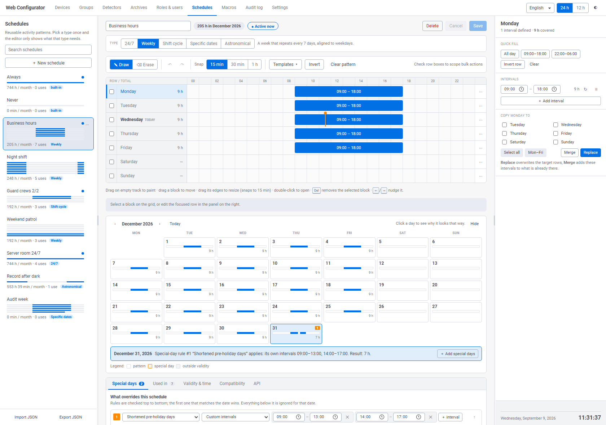
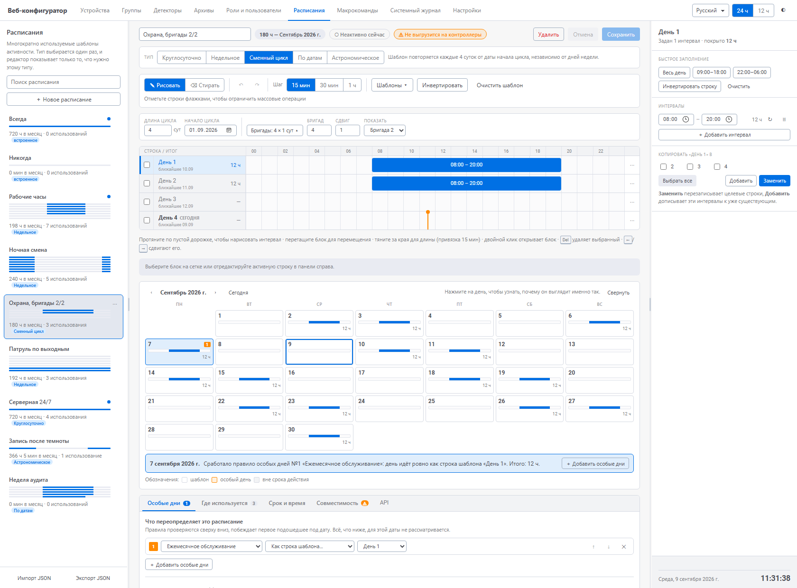
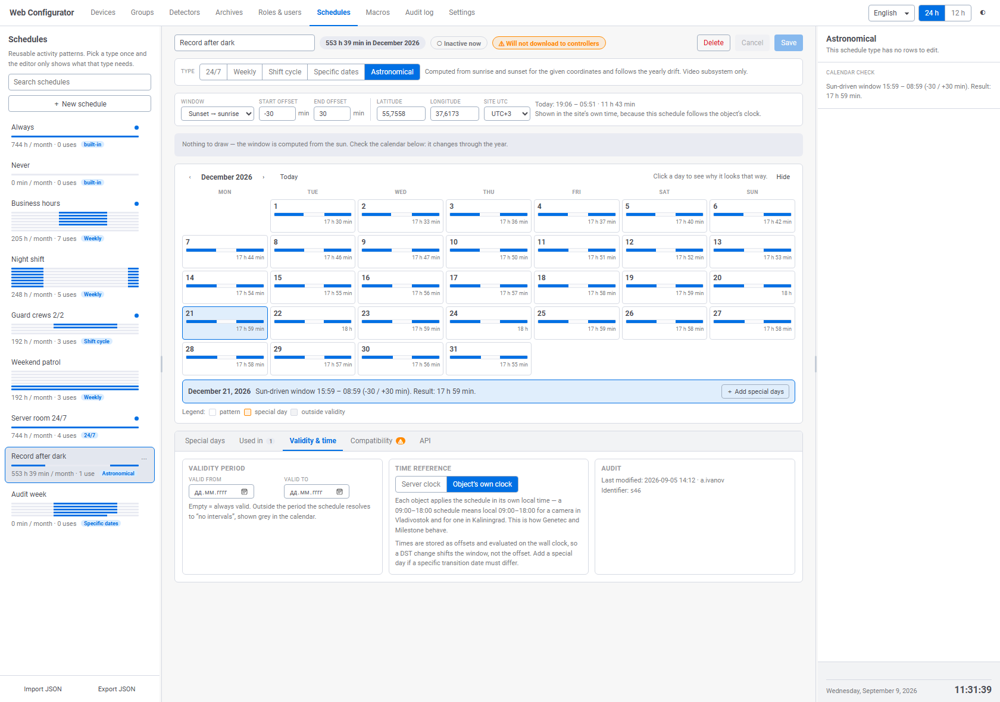
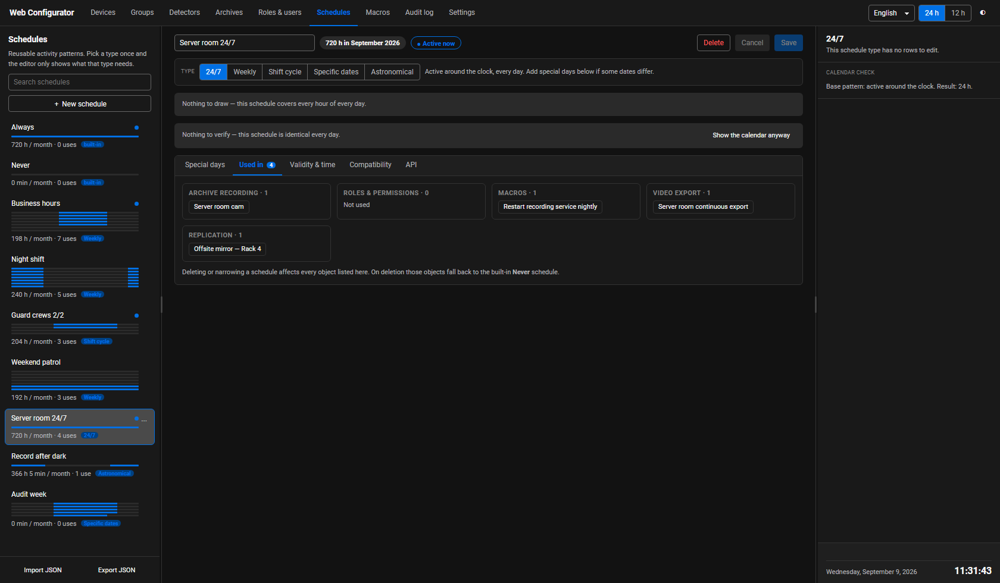

# Временные зоны / Time schedules — прототип для WEB-конфигуратора

Проработка экрана **«Временные зоны» / Time schedules** для веб-конфигуратора
ITV/Axxon (Интеллект X · Axxon One · Axxon Next). В репозитории лежат интерактивные
прототипы интерфейса и документы, объясняющие принятые решения.

**Исходная задача.** Существовал Figma-макет, повторяющий десктопный конфигуратор, и два
сгенерированных веб-прототипа. Ни один из трёх не покрывал функциональность целиком: у одного
была лучшая механика ввода, у другого — обзорность и защита изменений, а доменные возможности
десктопа (переход через полночь, праздники, периодичность) терялись в обоих.

Дальше прототип развивался тремя итерациями, каждая — от найденной проблемы, а не от идеи:

| Версия | Что её вызвало | Главное изменение |
|---|---|---|
| **v3** | Ни один исходный вариант не покрывал функционал целиком | Объединение сильных сторон трёх вариантов, возврат доменных возможностей десктопа |
| **v4** | `Efficiency_Analysis.MD` — v3 не выражал сменные графики: неделя из 7 строк не описывает цикл 2/2 | Цикл произвольной длины 2–31 сутки, бригады со сдвигом, единый резолвер, календарь результата |
| **v5** | `Comparision_with_other_SW.MD` — v4 сложнее шести продуктов рынка в массовом сценарии и беднее в особых днях | Тип расписания решает сложность редактора; праздники и исключения слиты в «Особые дни»; объяснение результата словами; проверка лимитов контроллеров |

---

## Быстрый старт

Откройте **`schedule_v5.html`** двойным кликом. Это один файл на ~183 КБ **без внешних
зависимостей** — ничего устанавливать и собирать не нужно, работает офлайн в любом современном
браузере.

В правом верхнем углу — переключатели языка (**Русский / English**), формата времени
(**24 ч / 12 ч**) и темы (светлая / тёмная). Данные демонстрационные, изменения живут только
до перезагрузки страницы.

Предыдущие версии оставлены рядом для сравнения: `schedule_v4.html`, `schedule_v3.html`.

---

## Как это выглядит

Недельное расписание, английская локаль. Календарь под сеткой показывает, что 31 декабря
отличается, а строка под ним объясняет, почему:



Сменный цикл 2/2 по второй бригаде, русская локаль. В шапке — предупреждение, что такое
расписание не выгрузится на контроллеры СКУД:



Астрономическое расписание: окно «закат → восход» вычисляется по координатам, и в календаре
виден годовой сдвиг — в декабре ночь на 10 часов длиннее июньской:



Круглосуточное расписание в тёмной теме — иллюстрация главного упрощения v5: сетки, тулбара
и календаря нет, потому что проверять и рисовать нечего:



Остальные снимки — в папке `shots/`: отчёт о совместимости, тип «по датам» с предпросмотром
контракта, библиотека групп дат, фильтр дней недели.

---

## Состав репозитория

### Прототипы

| Файл | Что это |
|---|---|
| **`schedule_v5.html`** | **Актуальный прототип.** Самодостаточный HTML со встроенными CSS и JS |
| `schedule_v4.html` | Предыдущая версия: цикл произвольной длины, бригады, календарь |
| `schedule_v3.html` | Первая сводная версия |

### Документы

Читать стоит в порядке появления — каждый следующий отвечает на проблему, найденную предыдущим.

| Файл | Что внутри |
|---|---|
| `Schedule_prototypes_analysis.md` | Разбор трёх исходных вариантов: сильные и слабые стороны, матрица покрытия функций, обоснование выбора базы |
| `TimeZones_Prototype_v3.MD` | Чем v3 отличается от двух исходных вариантов |
| `Efficiency_Analysis.MD` | Проверка v3 на реальных типах графиков (5/2, день/ночь, сменные, праздничные, «месяц по дням») с таблицей сценариев и списком дефектов |
| `TimeZones_Prototype_v4.MD` | Чем v4 отличается от v3 и как закрыты дефекты из анализа |
| `Comparision_with_other_SW.MD` | Сравнение v4 с Paxton Net2, ZKTeco, LenelS2 OnGuard, C•CURE 9000, Genetec Security Center, Milestone XProtect и PagerDuty: три матрицы по 22 признакам, 9 предложений по упрощению, 7 — по заимствованию, раздел о лимитах контроллеров |
| `TimeZones_Prototype_v5.MD` | Чем v5 отличается от v4 и трассировка к каждой рекомендации сравнения |

### Исходные материалы и служебное

| Файл | Что это |
|---|---|
| `Time Schedule.html` | Исходный сгенерированный прототип №1 (артефакт на внутреннем DSL `<x-dc>` / `DCLogic`) |
| `screenshot-1.png` | Исходный прототип №2 — скриншот страницы `#/time_zones` вместе с payload API в DevTools |
| `shots/v5-*.png` | Снимки состояний v5 |
| `v4_en.png`, `v4_ru.png`, `v3_en.png`, `v3_ru.png` | Превью предыдущих версий |
| `_dev/` | Проверочные скрипты: функциональные тесты v5, сверка расчёта солнца с NOAA, метрики версий |

---

## Что умеет актуальный прототип

**Тип расписания задаёт сложность редактора**
- Пять типов: круглосуточно · недельное · сменный цикл 2–31 сутки · по конкретным датам ·
  астрономическое. Плюс встроенные неизменяемые «Всегда» и «Никогда».
- Панель цикла, бригады, сетка и календарь появляются только там, где нужны. Смена типа
  сохраняет то, что новая форма может вместить, и предупреждает об остальном.

**Сетка и редактирование**
- 24 часа × число строк типа; рисование интервала протяжкой, стирание протяжкой (в том числе
  поверх существующих блоков — они разрезаются).
- Перетаскивание блока, изменение длины за края, двойной клик открывает блок в правой панели.
- Шаг привязки 15 / 30 / 60 мин, точный ввод — полями. Undo/redo на 60 шагов.

**Массовые операции**
- Чекбоксы строк задают область действия: шаблоны, инверсия и очистка бьют только по отмеченным.
- 14 шаблонов с мини-диаграммой: 7 недельных и 7 сменных циклов, включая 2/2 день и ночь,
  3/3, 4/4, 4/1, вахту 15/15 и «неделя А / неделя Б».
- Копирование строки в режиме замены или добавления, копирование одного интервала.

**Особые дни — одна сущность вместо трёх**
- Именованные **группы дат**, общие для всех расписаний, плюс локальные для одного.
- Правило внутри группы: диапазон дат (с ежегодным повтором и фильтром дней недели) либо
  **порядковое** — «второе воскресенье мая», «первый понедельник каждого месяца».
- В расписании — список правил сверху вниз, побеждает первое подошедшее. Приоритет меняется
  кнопками, номер победившего правила стоит в клетке календаря.
- Предупреждение о правилах, которые никогда не сработают из-за правила выше.
- Четыре режима: нерабочий · активно 24 часа · как строка шаблона · свои интервалы.

**Доменные возможности**
- **Интервалы через полночь** одной записью, а не двумя; продолжение рисуется в следующей
  строке штриховкой и правится из исходной.
- **Цикличные интервалы** «N мин каждые M мин» — для выборочной записи в архив.
- **Бригады со сдвигом**: один цикл на несколько бригад, просмотр по любой из них.
- **Астрономические окна**: восход/закат по координатам, смещения ±120 мин, корректная
  обработка полярного дня и полярной ночи.
- **Срок действия** расписания и **точка отсчёта времени**: часы сервера или часы объекта.

**Проверка результата**
- **Календарь** сразу под сеткой: цвет, номер сработавшего правила, часы за день. Сворачивается
  сам, если расписание одинаково каждый день.
- **Объяснение словами**: клик по дню даёт фразу «Сработало правило особых дней №2 «Летние
  субботы»: свои интервалы 06:00–21:00. Итого: 15 ч» — включая перечень проигравших правил.
- **Совместимость с оборудованием**: три профиля (сервер, панель на 3 интервала в сутки,
  панель на 6 интервалов на расписание) с конкретными причинами отказа.
- Часы за месяц в шапке, маркер текущего времени, бейдж «сегодня», признак «активно сейчас».
- Панель **«Где используется»**: запись в архив · роли · макрокоманды · экспорт видео · репликация.

**Защита изменений**
- Подтверждение любого разрушающего действия; при удалении — перечень зависимых объектов и
  предупреждение, что они перейдут на встроенное расписание «Никогда».
- Индикатор несохранённых изменений в строке состояния, предупреждение при переключении
  расписания с несохранёнными правками.

**Оболочка**
- Полная локализация RU / EN: 417 строк в словаре, согласование русских числительных, падежные
  формы дней недели, порядковые числительные.
- Формат 12 / 24 ч, светлая и тёмная темы на CSS-переменных-аналогах токенов `--one-*`.
- Регулируемая ширина боковых панелей, строка состояния с датой, днём недели и временем в
  формате выбранной локали.
- Импорт / экспорт JSON и **предпросмотр запроса к API** — прототип работает как исполняемая
  спецификация.

---

## Клавиатура

| Сочетание | Действие |
|---|---|
| `Ctrl+Z` | Отменить |
| `Ctrl+Shift+Z`, `Ctrl+Y` | Повторить |
| `Ctrl+S` | Сохранить |
| `Del`, `Backspace` | Удалить выбранный интервал |
| `←` / `→` | Сдвинуть интервал на шаг привязки |
| `Shift` + `←` / `→` | Изменить длительность интервала |
| `Esc` | Закрыть диалог или меню, снять выделение дня в календаре, снять выделение блока |
| `←` / `→` на разделителе панелей | Изменить ширину панели; с `Shift` — крупным шагом |
| `Home`, `Enter` на разделителе | Сбросить ширину панели |

---

## Модель данных

Интервал — тройка «начало, длина, периодичность», как в серверном контракте:

```js
{ id, start, len, cyc: null | { every, on } }   // start и len — минуты от 00:00
start + len > 1440                              // интервал переходит в следующий день
cyc: { every: 30, on: 5 }                       // активен 5 мин каждые 30 мин
```

Расписание — тип, шаблон, список правил особых дней и срок действия:

```js
{ id, name, pattern: { kind, days, anchor?, dates?, astro? },
  crewCount, crewStep,
  overrides: [ { groupId, mode, sameAsRow, iv } ],   // порядок = приоритет
  validFrom, validTo, tz: 'server' | 'object' }
```

Группа дат живёт отдельно и переиспользуется расписаниями:

```js
{ id, name, scope: 'global' | 'local', owner,
  rules: [ { kind: 'date',    from, to, yearly, dows }
         | { kind: 'ordinal', nth, dow, month } ] }
```

**Одно место принимает решение.** `effectiveOn(schedule, date)` последовательно применяет срок
действия, затем первое подошедшее правило особых дней, затем базовый шаблон. Календарь, сумма
часов, признак «активно сейчас» и предпросмотр запроса пользуются только им — расхождение между
тем, что нарисовано, и тем, что уйдёт на сервер, конструктивно невозможно.

Форма запроса и построчный разбор изменений контракта — в разделе 10 файла
`TimeZones_Prototype_v5.MD`.

---

## Открытые вопросы перед реализацией

Прототип содержит предположения о контракте и два архитектурных вопроса:

1. **Имя корневого ключа payload:** в DevTools второго прототипа виден `modify_intervals`.
2. **Поле `day_of_week` внутри `start`** — в наблюдаемом запросе были только `hour`, `minute`,
   `second`; без дня недели интервал не привязать к строке сетки.
3. **`pulse_seconds`** для длительности импульса цикличного интервала — имя предположительное.
4. **Контракт групп дат, астрономических окон и точки отсчёта времени** в веб-API не наблюдался.
5. **Разворот сменных циклов в календарные даты** перед выгрузкой на панели СКУД: либо серверный
   разворот, либо явное «сменные циклы только для видеоподсистемы». Решение продуктовое.
6. **Каталог профилей оборудования**: в прототипе три профиля зашиты, в продукте они должны
   приходить от каталога устройств.
7. **Часовой пояс объекта-потребителя** работает для астрономического типа; для остальных
   резолвер должен получать пояс от объекта.

Подробности — в разделе 11 файла `TimeZones_Prototype_v5.MD`.

---

## Проверка

```
node _dev/test_v5.js            # 111 функциональных проверок
node _dev/check_sun_vs_noaa.js  # сверка расчёта солнца с формулами NOAA
node _dev/metrics.js            # метрики версий
```

Тесты грузят `schedule_v5.html`, подставляют заглушки DOM и проверяют резолвер для всех типов
расписаний, приоритеты правил, порядковые правила, арифметику интервалов, лимиты оборудования,
объяснения на двух языках, форму запроса к API и полноту словаря.

---

## Замечание по терминологии

В десктопном конфигураторе раздел называется **«Временные зоны» / "Time zones"**, хотя речь идёт
не о смещениях UTC, а о расписаниях активности. В документации Axxon One 1.0/2.0 тот же экран
называется **"Time Schedules"**, а в 3.0 вернулись к "Time zones". Второй прототип использует URL
`#/time_zones`, но заголовок панели — «Временные расписания».

Рынок при этом уходит от слова «зона»: Paxton в новой линейке переименовал Timezone → Time
profile, C•CURE — Time Specification → Schedule, Genetec и Milestone изначально используют
Schedule и Time Profile.

**Рекомендация:** закрепить название **«Расписания» / "Schedules"**, «временные зоны» оставить
устаревшим синонимом в подсказке и поиске. Это тем важнее, что v5 добавляет настоящую работу с
часовыми поясами объектов — и два смысла в одном слове станут прямой проблемой. В прототипе так
и сделано.

---

## Ссылки

- [Axxon One 3.0 — Time zones](https://docs.axxonsoft.com/confluence/spaces/ONE2025/pages/314537999/Time+zones)
- [Axxon One 1.0 — Creating schedules](https://docs.axxonsoft.com/confluence/spaces/one1en/pages/226952566/Creating+schedules)
- [Configuring macros](https://docs.axxonsoft.com/confluence/spaces/one20en/pages/246485017/Configuring+macros) — прототип `Heartbeat interval` для цикличных интервалов
- Источники по продуктам-конкурентам — в конце `Comparision_with_other_SW.MD`
