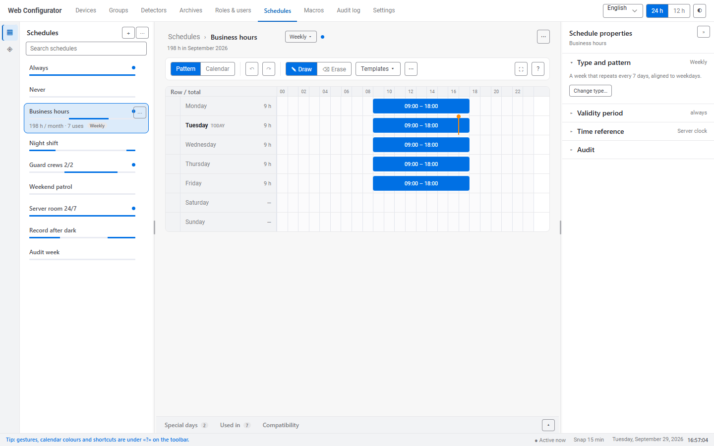

# Временные зоны / Time schedules — чем прототип v7 отличается от v6

**Файл:** `../prototypes/schedule_v7.html` (3220 строк, 211 КБ; рядом должны лежать `bridge.css` и `theme/`).
**Основание:** `Efficiency_Analysis_v2.MD` — анализ перегруженности v6 и предложенная раскладка.
**Что не менялось:** модель расписаний, резолвер, особые дни, совместимость, контракт API, вся
логика редактирования — это код v6 без изменений. Переписан только слой отрисовки и событий.

---

## Коротко

v7 — это та же функциональность в раскладке по образцу VS Code: сворачиваемый список слева,
контекстные свойства справа, редкие разделы в нижней панели, свёрнутой до строки вкладок,
состояние и часы — в строке состояния внизу. На экране по умолчанию видно **43 элемента
управления вместо 98, 116 слов вместо 339 и 2 подсказки вместо 15**. Все 117 действий v6 остались
достижимы, это проверено автоматически.

---

## 1. Решения владельца, принятые перед v7

| Вопрос из `Efficiency_Analysis_v2.MD` | Решение | Как сделано |
|---|---|---|
| Правая панель открыта или свёрнута | как предложено: открыта, но на свойствах расписания, а не на понедельнике | инспектор по умолчанию показывает «Свойства расписания»; строка, интервал или день — только когда их выбрали |
| Вкладка API | только в режиме разработчика | вкладка скрыта; режим включается `Ctrl+Shift+D`, кнопкой в справке «?» или адресом `…?dev=1`; пока он включён, в строке состояния стоит метка «Разработчик» |
| Язык и формат времени | остаются в шапке: в продукте они уйдут в общие настройки конфигуратора, здесь — только для демонстрации | не переносились в строку состояния |

Два вопроса владелец оставил без ответа — взял предложенные варианты: **полоса видов из двух
пунктов** и **«Шаблон» по умолчанию** с запоминанием выбора пользователя.

---

## 2. Раскладка

| Область | v6 | v7 |
|---|---|---|
| Полоса видов слева | — | «Расписания» и «Группы дат»; клик по активному пункту сворачивает список, как в VS Code; бейдж, если какая-то группа дат никогда не срабатывает |
| Список расписаний | всегда открыт, у каждой карточки 7 полосок и строка «часы · использования · тип» | сворачивается (`Ctrl+B`); карточка — название, одна полоса «как сегодня», точка «активно»; сведения — у выбранной и в подсказке при наведении; «Новое» и импорт/экспорт — иконки в заголовке |
| Библиотека групп дат | раскрывашка внизу вкладки одного расписания | отдельный вид в боковой панели — туда же ведёт ссылка из «Особых дней» |
| Заголовок | поле названия, две пилюли, «Удалить», «Отмена», «Сохранить» | хлебные крошки «Расписания › Рабочие часы» с правкой названия по клику, кнопка типа, точка «активно»; «Отмена» и «Сохранить» — только когда есть изменения; «Удалить» — в «⋯» |
| Тип расписания | сегменты на 5 кнопок и подсказка | кнопка с текущим типом → меню с описаниями (двухстрочные пункты D-044) |
| Цикл, солнце, даты | панель полей над сеткой | одна строка-итог «Цикл 4 сут · с 01.09.2026 · 4 × 1 сут ✎»; поля — в свойствах |
| Панель инструментов | 15 кнопок и подсказка | «Шаблон / Календарь», отменить/повторить, рисовать/стирать, «Шаблоны», «⋯»; справа «⛶» и «?» |
| Сетка и календарь | стопкой друг под другом | переключатель: одна проекция за раз; у астрономического и круглосуточного сетки нет — сразу календарь |
| Чекбоксы и «⋯» строк | всегда | при наведении и фокусе с клавиатуры; видны у всех, как только отмечена хоть одна строка |
| Массовые действия | полоса под сеткой | панель инструментов сама превращается в панель действий над отмеченными строками |
| Полоса выбранного блока, объяснение дня | под сеткой и под календарём | в инспекторе |
| Нижние вкладки | 5 вкладок, всегда раскрыты | нижняя панель, свёрнута до вкладок с бейджами (`Ctrl+J`); «Срок и время» ушла в свойства; «API» — в режиме разработчика |
| Строка состояния | в углу инспектора | на всю ширину: сообщение, «активно сейчас», шаг привязки, дата и время |
| Подсказки и легенда | 15 абзацев на экране | под «?»: жесты, цвета календаря, сочетания, «Сбросить раскладку», режим разработчика; при первом входе — одна строка в строке состояния |
| Режим «Фокус» | — | `Ctrl+K Z` или «⛶»: только редактор и строка состояния; `Esc` возвращает |

## 3. Инспектор: четыре состояния

| Выбрано | Что показано |
|---|---|
| ничего | **Свойства расписания**: «Тип и шаблон» (раскрыт; для цикла — длина, начало, бригады, сдвиг, просмотр бригады; для «по датам» — добавление даты; для астрономического — окно, смещения, координаты, пояс), «Срок действия», «Точка отсчёта времени», «Аудит». У свёрнутого раздела в заголовке итог: «всегда», «Время сервера» |
| строка (клик по дню недели) | интервалы строки, «+ Добавить интервал», свёрнутые «Быстрое заполнение» и «Копировать в» |
| блок на сетке | время начала и конца, цикличность, «Копировать в…», «Удалить» |
| день календаря | объяснение, почему день такой, «Открыть в «Особых днях»» и «+ Добавить особые дни» |

Над всеми, кроме свойств, — «‹ Свойства расписания». `Esc` отступает на шаг: интервал → строка →
свойства. Клик по названию дня или по дню календаря сам раскрывает свёрнутый инспектор;
рисование на сетке — нет. У панели есть своя кнопка «»», а когда она свёрнута, в панели
инструментов появляется «◨».

## 4. Сочетания клавиш

`Ctrl+B` — список · `Ctrl+Alt+B` — свойства · `Ctrl+J` — нижняя панель · `Ctrl+K Z` — «Фокус» ·
`Ctrl+Shift+D` — режим разработчика · `Esc` — шаг назад · прежние `Ctrl+Z/Y/S`, `Del`, стрелки.

**Исправлено попутно:** в v6 сочетания сравнивались по символу клавиши, и при русской раскладке
`Ctrl+Z` не работал — клавиша давала «я». В v7 все сочетания сравниваются по физической клавише.

## 5. Запоминание и узкие экраны

Раскладка — открытые панели, их ширина и высота, активная вкладка, вид, раскрытые разделы,
режим разработчика — сохраняется в браузере пользователя. «Фокус» при повторном входе не
восстанавливается: пустой экран после перезагрузки выглядел бы как поломка. При первом входе на
экране уже 1280px инспектор свёрнут, уже 1000px — и список; явный выбор пользователя важнее.

## 6. Попапы у края экрана — закрыт вопрос 7

В v6 `popAt()` предполагала, что любой попап не выше 300px, и меню «Добавить особые дни» у нижнего
края обрезалось (вопрос 7 в `BRIDGE-README.md`). В v7 попап ставится по своему реальному размеру:
под кнопкой, над ней, если снизу нет места, прижимается к правому краю, прокручивается, если выше
окна.

---

## 7. Замеры

`../tests/ui_density.js` schedule_v7.html против того же замера v6. «Видно в покое» — без
элементов, которые появляются только при наведении; правило одно для обеих версий.

| Экран по умолчанию | v6 | v7 | Цель из анализа |
|---|---:|---:|---:|
| Элементов управления видно в покое, «Рабочие часы» | 98 | **43** | 35–40 |
| То же, «Охрана, бригады 2/2» | 81 | **50** | — |
| Слов текста, «Рабочие часы» | 339 | **116** | ~120 |
| Абзацев-подсказок | 15 | **2** | 0–1 |
| Горизонтальных полос в центре | 5 | **3** (заголовок, инструменты, сетка) + строка вкладок | 2 + строка вкладок |

Для недельного расписания цель превышена на 3, и причина известна: она считалась с переносом
языка и формата времени в строку состояния, а владелец оставил их в шапке — это три элемента. У
сменного цикла 50, потому что в свойствах раскрыт раздел «Тип и шаблон» с пятью полями цикла и
бригад — так задумано: это и есть его параметры, и раздел сворачивается одним кликом.

## 8. Проверка

| Проверка (запуск из корня проекта, команды — в README) | Результат |
|---|---|
| `../tests/test_v5.js` schedule_v7.html — функциональный набор | 111/111: логика расписаний не тронута |
| `../tests/test_v7_layout.js` — новая раскладка | 66/66: области, сворачивание и сочетания, четыре состояния инспектора, режим разработчика, запоминание, **все 117 действий v6 достижимы** (7 — под новым именем), сохранение прокрутки во всех областях |
| `../tests/check_bridge.js` | 29/29; все 109 селекторов bridge существуют в v6 или v7 |
| `../tests/test_v6_scroll.js` | 40/40 — и поймал в новом правиле bridge смену цвета при наведении (нарушение D-022), исправлено |
| `npm run check` кита | сборка прошла: `<кит>/dist/schedule_v7.html`, 240 КБ. Офлайн-этап не запустился: встроенный в кит Chromium на этой машине не стартует («spawn UNKNOWN») |
| Офлайн-загрузка собранного файла через Edge (`tests/shots_edge.mjs --offline`) | 0 сетевых запросов, 0 ошибок, Inter загружен |

Снимки — `../screenshots/v7-*.png`: экран по умолчанию в светлой и тёмной теме, выбранная строка,
нижняя панель на «Совместимости», календарь с объяснением дня, «Фокус», справка, библиотека групп,
окно 1200px, сменный цикл и «Особые дни» в русской локали, собранный файл офлайн.

## 9. Что осталось

1. **Сворачиваемых панелей нет в дизайн-системе ONE PSIM.** Состояния полосы видов и выбранного
   пункта меню взяты из существующих лестниц (навигация D-031, пункт меню §2.9a), но для самих
   сворачиваемых панелей и разделов лестницы нет — кит ставит «Accordion» и «скрытие/открытие
   панелей» следующими в свою лабораторию. Когда они появятся, раскладку v7 стоит пересверить.
2. **`npm run check` кита целиком** на этой машине не проходит из-за его браузера; нужен запуск на
   машине, где Chromium кита стартует, либо поддержка Edge в самом ките.
3. **Сочетания `Ctrl+J` и `Ctrl+Shift+D`** в браузере заняты (загрузки, закладки). Страница их
   перехватывает, но если браузер или политика компании не отдаст сочетание странице, те же
   действия доступны кнопками.
4. **Метки «Фокуса» и справки** сделаны текстовыми символами (⛶, ?, ◨, »), как и остальные иконки
   прототипа; единое иконочное семейство — отдельное решение (§2.11 кита не требует менять).
